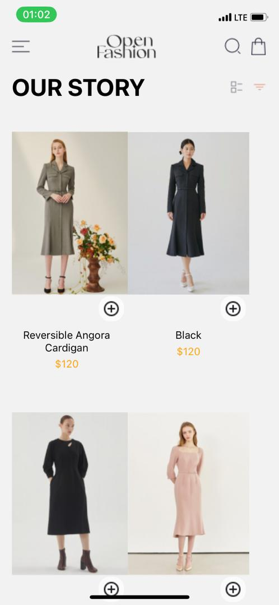
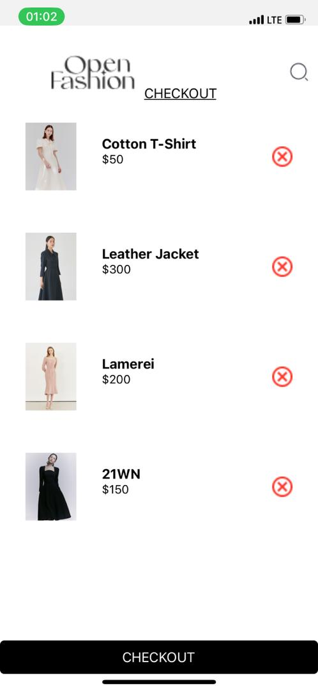

# React Native Fashion App

This is a React Native application for a fashion e-commerce platform, allowing users to browse and purchase clothing items.

---

## Table of Contents

1. [Introduction](#introduction)
2. [Features](#features)
3. [Screenshots](#screenshots)
4. [Installation](#installation)
5. [Usage](#usage)
6. [Technologies Used](#technologies-used)
7. [Contributing](#contributing)
8. [License](#license)

---

## Introduction

Welcome to the React Native Fashion App! This application provides a seamless shopping experience for fashion enthusiasts, showcasing a variety of clothing items.

---

## Features

- Browse a collection of fashion products.
- Add items to the shopping cart.
- View and edit items in the shopping cart.
- Checkout functionality.

---

## Screenshots

- **Home Screen**
  

- **Cart Screen**
  

---

## Installation

To run this project locally, follow these steps:

1. Clone the repository:
   ```bash
   git clone https://github.com/Edemowns/rn-assignment6-11052329.git
   cd project-directory
